# Proyecto: Recreando el Templo Mayor en Unity

## Paso 1: Abrir ProBuilder
En este proyecto estaremos recreando el Templo Mayor azteca en Unity utilizando ProBuilder. El primer paso es abrir la ventana de ProBuilder, esto se puede hacer abriendo la ventana superior de “Tools”, luego “ProBuilder” y finalmente “ProBuilder Window”.  
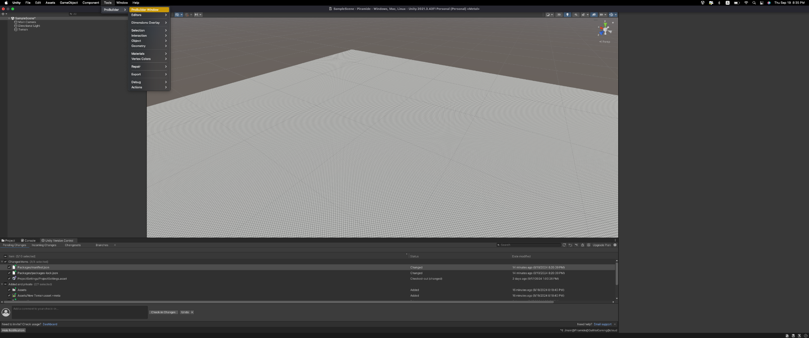

## Paso 2: Crear una nueva forma
Una vez que tenemos esta ventana abierta, podemos crear una "New Shape," la primera opción en la ventana de ProBuilder. Esto abre una nueva ventana donde elegimos el tipo de forma que queremos. En nuestro caso, seleccionaremos un plano y estableceremos el número de divisiones que queremos para el plano.  
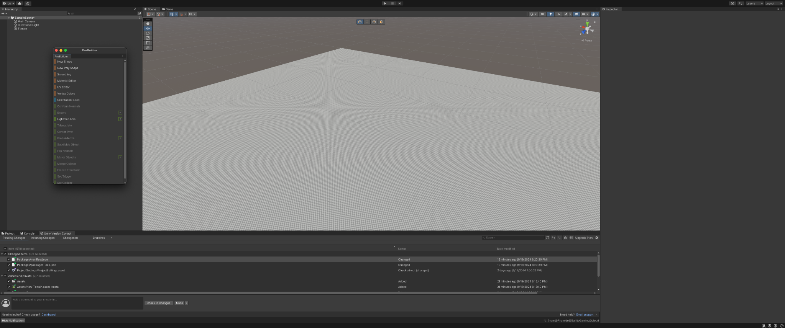

## Paso 3: Visualización de las divisiones
El plano que se muestra a continuación está dividido dos veces verticalmente y dos veces horizontalmente.  
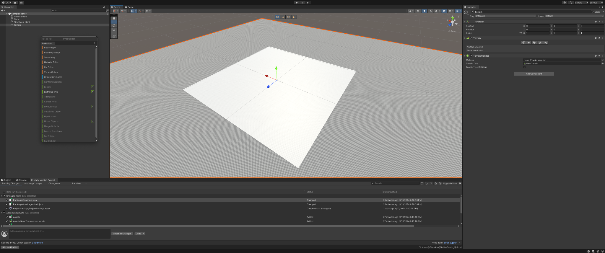

## Paso 4: Seleccionar vértices y ajustarlos
Después de crear el plano, podemos ver que tiene las divisiones que seleccionamos anteriormente. El siguiente paso es seleccionar los vértices y moverlos para hacer que las caras exteriores sean más pequeñas.  
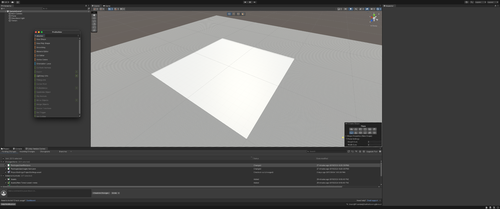

## Paso 5: Elevar las caras exteriores
Ahora necesitamos elevar las caras exteriores y la cara interior, manteniendo las esquinas en el fondo. Lo hacemos seleccionando la opción de "Extrude Faces" en ProBuilder.  
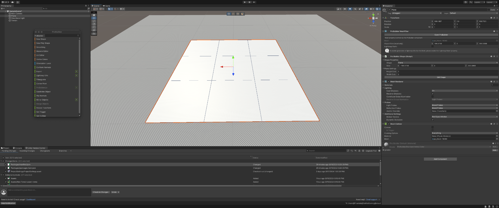

## Paso 6: Repetir para todos los niveles
Repetimos este proceso para todos los niveles. Cuando tengamos todos los niveles, seleccionamos todos los bordes exteriores, elegimos la herramienta de bordes y seleccionamos bevel.  
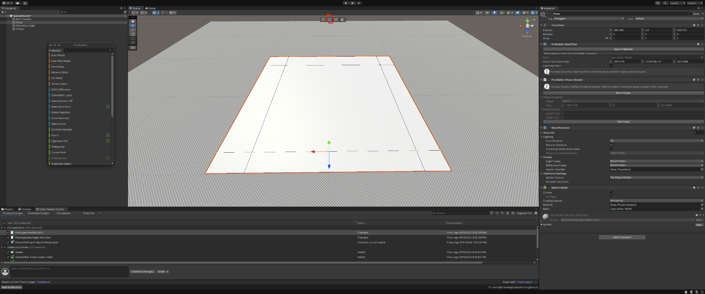

## Paso 7: Crear la forma final del Templo Mayor
Cuando tengamos todos los bordes biselados, seleccionamos los bordes y los bajamos para crear la forma del Templo Mayor.  
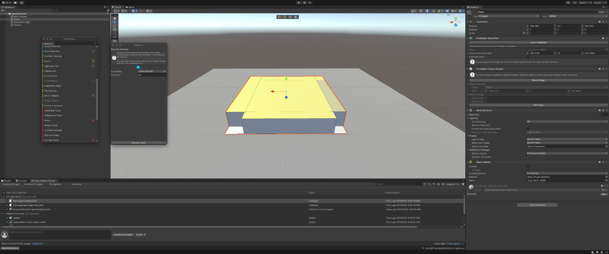

## Paso 8: Añadir escaleras
Ahora añadiremos las escaleras al frente. Creamos una nueva forma con ProBuilder, especificamos la cantidad de escalones y añadimos la escalera a nuestra pirámide.  

## Paso 9: Añadir estructuras superiores
Para finalizar el Templo Mayor, añadimos dos estructuras en la parte superior. Creamos una nueva forma cúbica y utilizamos extrude faces para crear las puertas.  

## Paso 10: Ajustar techos y duplicar
Arreglamos los techos usando extrude faces y bevel, luego duplicamos la casa para tener ambas estructuras en la parte superior del Templo Mayor.  
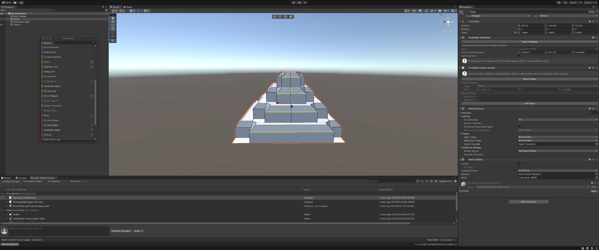

## Paso 11: Añadir detalles y texturas
Agregamos detalles como bordes en las escaleras para duplicar mejor el Templo Mayor.  
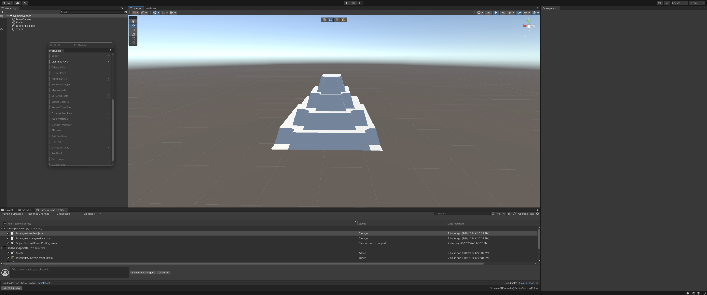

## Paso 12: Descargar y añadir assets
Descargamos assets gratuitos y añadimos un skybox y un plano de agua para darle más ambiente a la escena.  
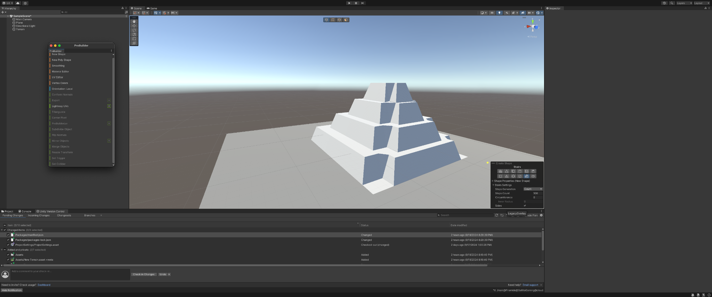

## Paso 13: Añadir entorno y vegetación
Añadimos árboles, arbustos, troncos, rocas y animales alrededor del entorno.  
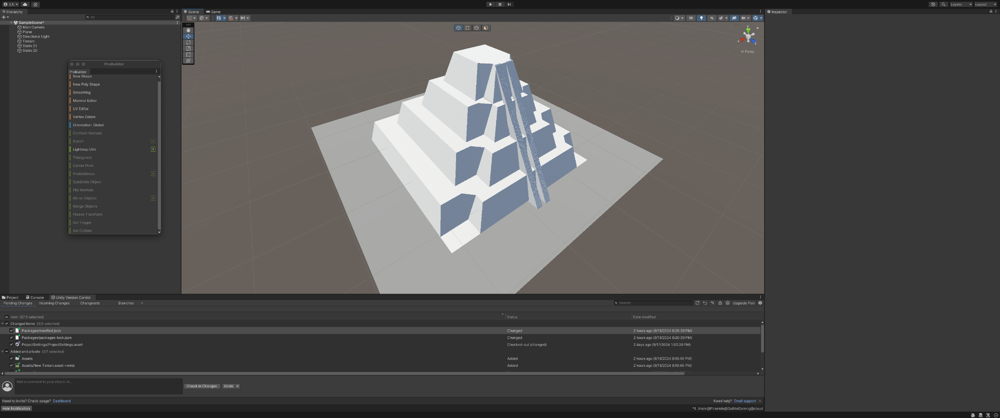

## Paso 14: Añadir cazador de recompensas
En la cima de la pirámide, añadimos un cazador de recompensas armado con un revolver enfrentándose a guardias esqueléticos.  
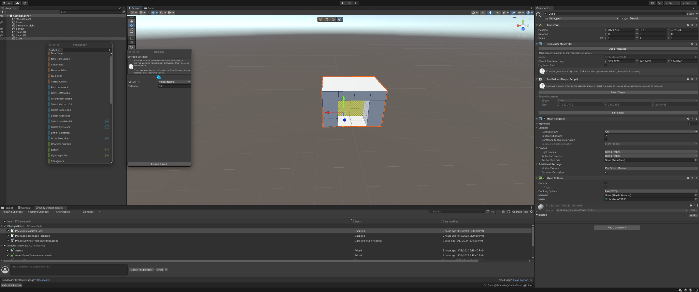

## Paso 15: Ajustar el terreno y colinas
Añadimos colinas y texturas al fondo para completar la escena.  
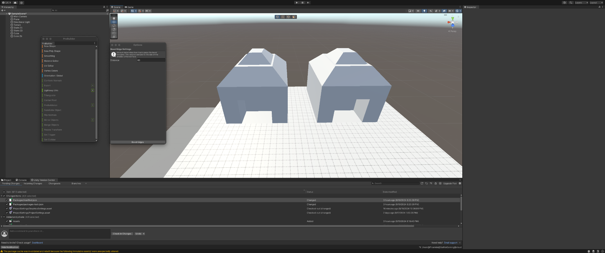

## Paso 16: Escenario del enfrentamiento final
Creamos el escenario para el enfrentamiento final del juego, donde Marcus se enfrenta al señor esqueleto.  
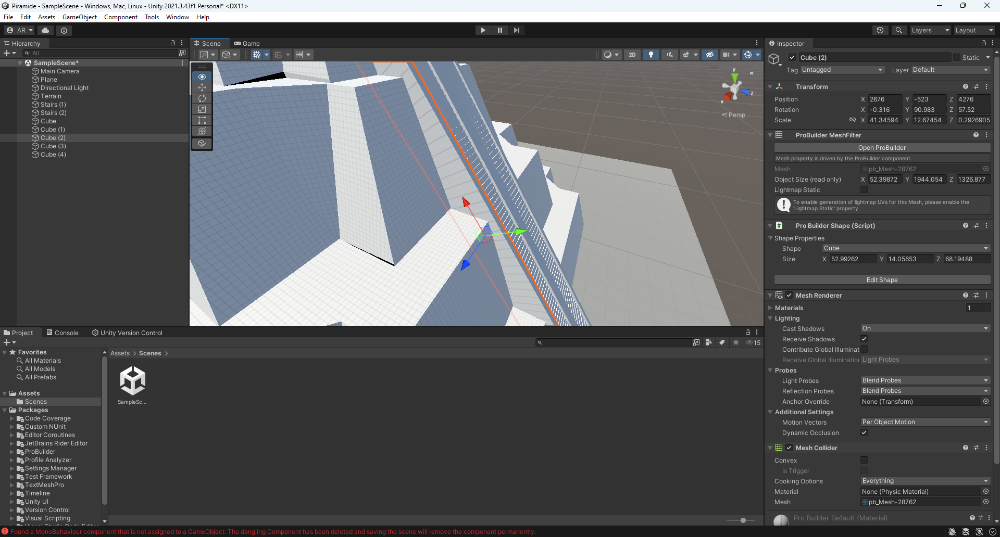

## Paso 17: Añadir colapso del templo
Después de la batalla, añadimos el colapso del templo mientras Marcus escapa con los tesoros.  
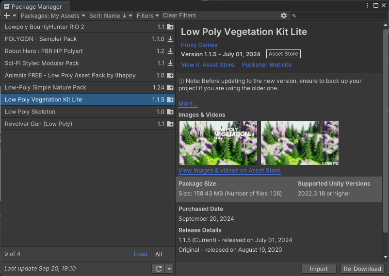

## Paso 18: Colocación de trampas
Añadimos trampas en el templo que Marcus deberá evitar o desactivar.  
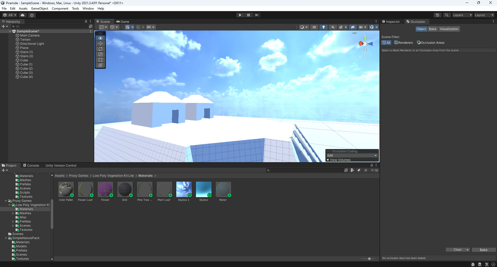

## Paso 19: Añadir puentes colgantes
Colocamos puentes colgantes que unen las diferentes secciones del templo.  
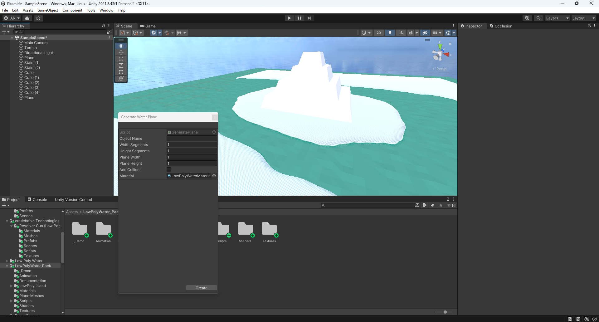

## Paso 20: Establecer iluminación
Agregamos iluminación para darle una atmósfera más sombría y misteriosa al templo.  
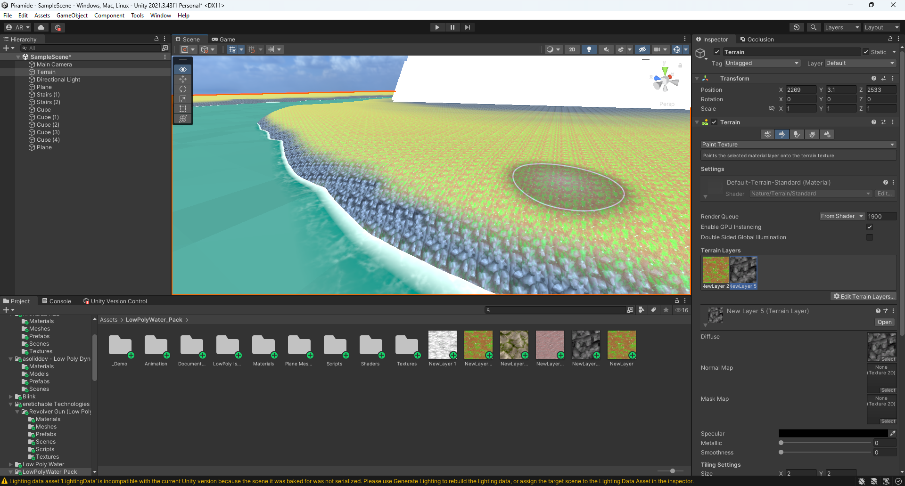

## Paso 21: Ajustar animaciones
Se ajustan las animaciones de los enemigos y del protagonista para dar fluidez a los combates.  
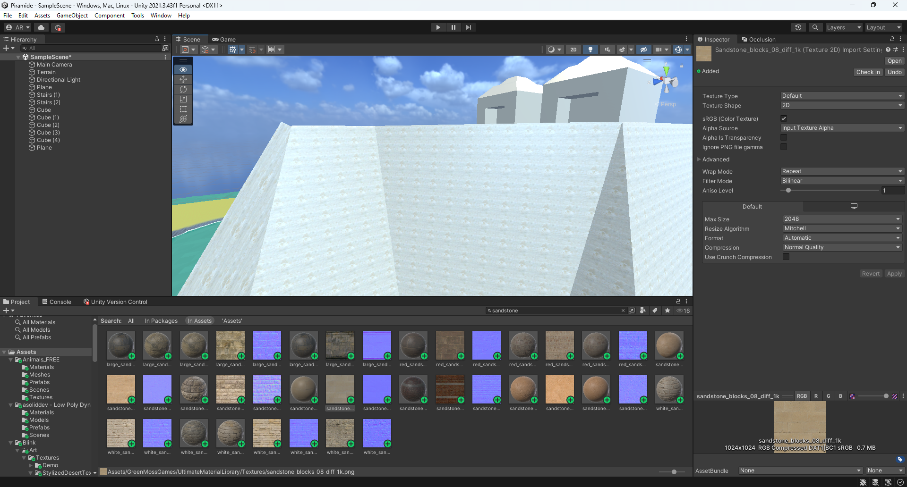

## Paso 22: Añadir música y sonidos ambientales
Se añade una banda sonora y sonidos ambientales para mejorar la inmersión.  
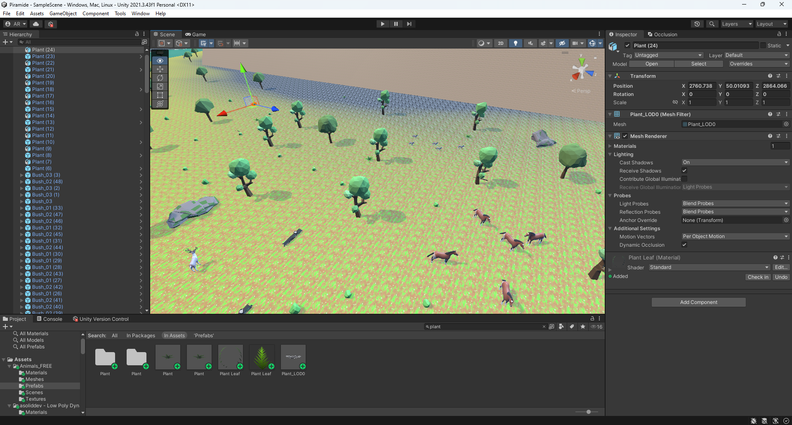

## Paso 23: Optimización del rendimiento
Optimizamos el rendimiento del juego ajustando texturas y modelos para asegurar una experiencia fluida.  
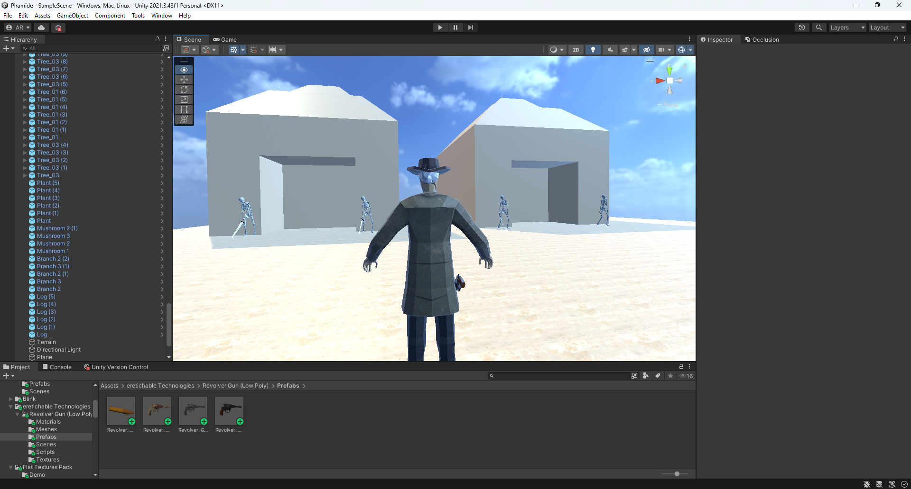

## Paso 24: Implementar controles finales
Se implementan los controles finales para que el jugador pueda interactuar de manera óptima con el entorno.  
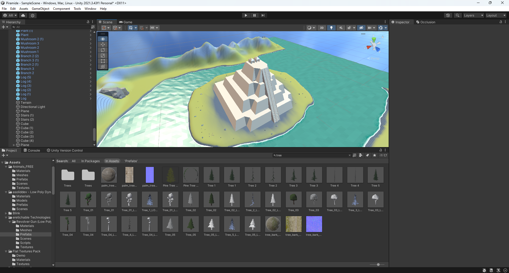

## Paso 25: Realizar pruebas y correcciones
Realizamos pruebas exhaustivas del juego para detectar y corregir errores.  
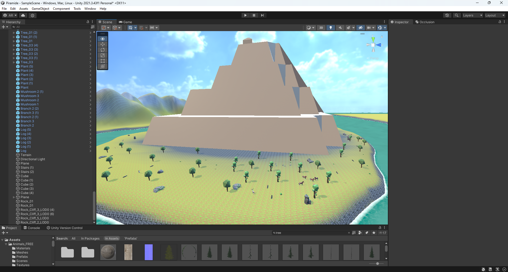

## Paso 26: Versión final del Templo Mayor
Presentamos la versión final del Templo Mayor, completada y lista para el juego.  
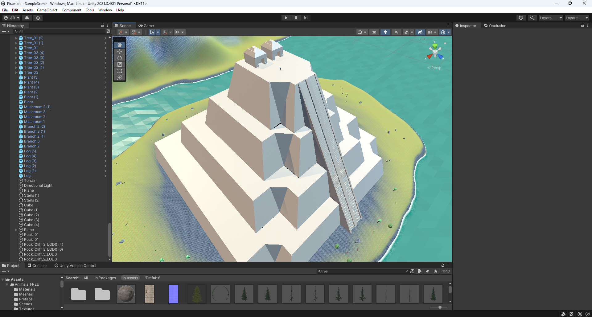

## Short Story
In "Shadow of the Serpent," players embody Marcus Steele, a seasoned bounty hunter known for his sharp wit and trusty revolver. Drawn by rumors of immeasurable wealth, Marcus ventures deep into the Mexican jungle, following a mysterious map that leads to an ancient Aztec pyramid lost to time.

The game journey begins as Marcus treks through dense foliage and treacherous terrain, the jungle being alive with the sounds of unseen creatures. The air thick with humidity and tension from the wildlife predators as he approaches the looming pyramid, its large stone steps and amazing architecture showing that a prosporous civilization once thrived there.

Entering the pyramid, Marcus navigates a labyrinth of dimly lit corridors and walls adorned with cryptic symbols. His first encounter are skeletal warriors wielding sharp obsidian swords, risen to guard the pyramid's treasures. With quick reflexes and precise gunfire, he fends off the undead guardians, each battle more intense than the last.

Along with fighting various skeleton enemies, Marcus must outsmart deadly traps by dodging poisoned darts, evading swinging blades, and leaping over pits. Cryptic puzzles block his path, requiring him to decipher Aztec symbols and manipulate ancient mechanisms. His survival hinges on a keen mind as much as a steady hand.

At the pyramid's core, Marcus confronts the formidable Skeletal Lord, a towering figure adorned with a feathered headdress and wielding an enchanted obsidian greatsword that deals tremendous damage. In a climactic boss battle, he must exploit the Skeletal Lord's weaknesses while avoiding devastating attacks. Utilizing the environment and his arsenal found from previous adventurers that perished, Marcus ultimately defeats the undead monarch.

With the Skeletal Lord vanquished, the pyramid begins to crumble. Marcus snatches a legendary artifact that was being protected, the serpent idol with emerald eyes and begins his harrowing escape. The corridors begin to collapse, and new traps spring to life. Racing against time, he leaps over chasms and dodges falling debris, relying on both courage and agility.

Emerging from the collapsing structure just as it seals itself forever, Marcus stands amidst the settling dust and the sun casts a warm glow, he reflects on the perilous journey. Treasure in hand, he begins the trek back, adventure over but contemplating the mysteries he's uncovered and other legends yet to be explored.

"Shadow of the Serpent" offers an exhilarating blend of action, exploration, and puzzle-solving, immersing players in a world where ancient myths collide with perilous adventure. An adventure not only for the treasure but for the knowledge of uncovering legends lost to time.

